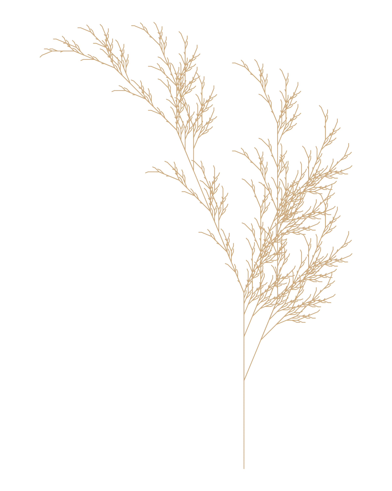

## 1. Anscombe's Quartet

### Visualization

```{r}
#| label: anscombe-plot
#| warning: false
#| message: false
#| fig-cap: "Anscombe's Four Regression Datasets"

data(anscombe)

# Fit linear models for all four datasets
ff <- y ~ x
mods <- setNames(as.list(1:4), paste0("lm", 1:4))

for(i in 1:4) {
  ff[2:3] <- lapply(paste0(c("y","x"), i), as.name)
  mods[[i]] <- lm(ff, data = anscombe)
}

# Plot all four datasets
op <- par(mfrow = c(2, 2), mar = 0.1+c(4,4,1,1), oma = c(0, 0, 2, 0))

for(i in 1:4) {
  ff[2:3] <- lapply(paste0(c("y","x"), i), as.name)
  plot(ff, data = anscombe,
       col = "red", pch = 21, bg = "orange", cex = 1.2,
       xlim = c(3, 19), ylim = c(3, 13))
  abline(mods[[i]], col = "blue")
}

mtext("Anscombe's 4 Regression data sets", outer = TRUE, cex = 1.5)
par(op)
```

### Analysis

Anscombe's Quartet, introduced by Francis J. Anscombe in 1973, presents four datasets that are statistically identical in terms of means, variances, correlations, and regression coefficients, yet reveal fundamentally different patterns when visualized. Dataset I displays a clean linear relationship between x and y. Dataset II follows a nonlinear, curved pattern that a straight regression line poorly represents. Dataset III is nearly perfectly linear except for a single influential outlier that distorts the regression. Dataset IV shows all x values clustered at a single point except one, making the regression line entirely dependent on that one observation. The core lesson is that summary statistics alone are dangerously insufficient for understanding data structure. The solution Anscombe proposed remains essential today: always visualize your data before drawing analytical conclusions, as graphical inspection reveals structural patterns, outliers, and distributional anomalies that numerical summaries systematically conceal.

---

## 2. Fall.R Visualization

### Custom Fall Color Palette

The original Fall.R uses `burlywood3` as the branch color. Below I apply a custom autumn palette using deep crimson (`#8B1A1A`) to evoke the richer, darker tones of late fall foliage.

```{r}
#| label: fall-plot
#| warning: false
#| message: false
#| fig-cap: "Fall Leaf — Custom Color Palette"
#| eval: false

# Note: install packages once if not already installed
# install.packages(c("gsubfn", "proto", "tidyverse"))

library(gsubfn)
library(tidyverse)

# L-system parameters for fall leaf
axiom  <- "X"
rules  <- list("X" = "F-[[X]+X]+F[+FX]-X", "F" = "FF")
angle  <- 22.5
depth  <- 6

for (i in 1:depth) axiom <- gsubfn(".", rules, axiom)

actions <- str_extract_all(axiom, "\\d*\\+|\\d*\\-|F|L|R|\\[|\\]|\\|") %>% unlist

status <- data.frame(x = numeric(0), y = numeric(0), alfa = numeric(0))
points <- data.frame(x1 = 0, y1 = 0, x2 = NA, y2 = NA, alfa = 90, depth = 1)

for (action in actions) {
  if (action == "F") {
    x <- points[1, "x1"] + cos(points[1, "alfa"] * (pi / 180))
    y <- points[1, "y1"] + sin(points[1, "alfa"] * (pi / 180))
    points[1, "x2"] <- x
    points[1, "y2"] <- y
    data.frame(x1 = x, y1 = y, x2 = NA, y2 = NA,
               alfa = points[1, "alfa"],
               depth = points[1, "depth"]) %>% rbind(points) -> points
  }
  if (action %in% c("+", "-")) {
    alfa <- points[1, "alfa"]
    points[1, "alfa"] <- eval(parse(text = paste0("alfa", action, angle)))
  }
  if (action == "[") {
    data.frame(x = points[1, "x1"], y = points[1, "y1"],
               alfa = points[1, "alfa"]) %>% rbind(status) -> status
    points[1, "depth"] <- points[1, "depth"] + 1
  }
  if (action == "]") {
    depth_val <- points[1, "depth"]
    points[-1, ] -> points
    data.frame(x1 = status[1, "x"], y1 = status[1, "y"],
               x2 = NA, y2 = NA,
               alfa = status[1, "alfa"],
               depth = depth_val - 1) %>% rbind(points) -> points
    status[-1, ] -> status
  }
}

ggplot() +
  geom_segment(aes(x = x1, y = y1, xend = x2, yend = y2),
               lineend = "round",
               color = "#8B1A1A",  # Custom: deep crimson fall color
               data = na.omit(points)) +
  coord_fixed(ratio = 1) +
  theme_void() +
  labs(caption = "Fall Leaf | Custom Color: Deep Crimson (#8B1A1A)")
```

> Note: The Fall.R plot is computationally intensive and takes 1-2 minutes to generate. Run the code in RStudio to view the output, then save and embed the image below.



---

## 3. Chart Critique

### Selected Chart

> **Source:** [INSERT SOURCE — book, article, or news website]


### Critique

**What works:**

[2-3 sentences on strengths — clarity, labeling, appropriate chart type, color use]

**What does not work:**

[2-3 sentences on weaknesses — clutter, misleading axes, poor color, missing context]

**How to improve it:**

[2-3 sentences following Nathan Yau's principles — simplify, annotate, use better chart type]

---

## References

Anscombe, F. J. (1973). Graphs in statistical analysis. *The American Statistician, 27*(1), 17-21.

Yau, N. (2011). *Visualize this: The FlowingData guide to design, visualization, and statistics.* Wiley.