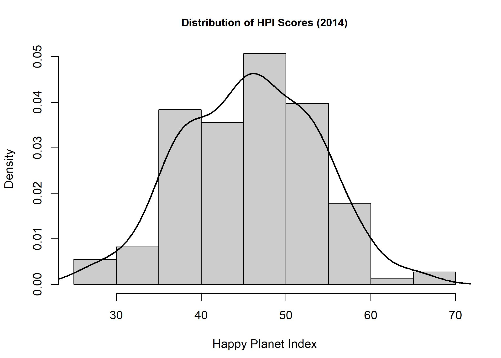
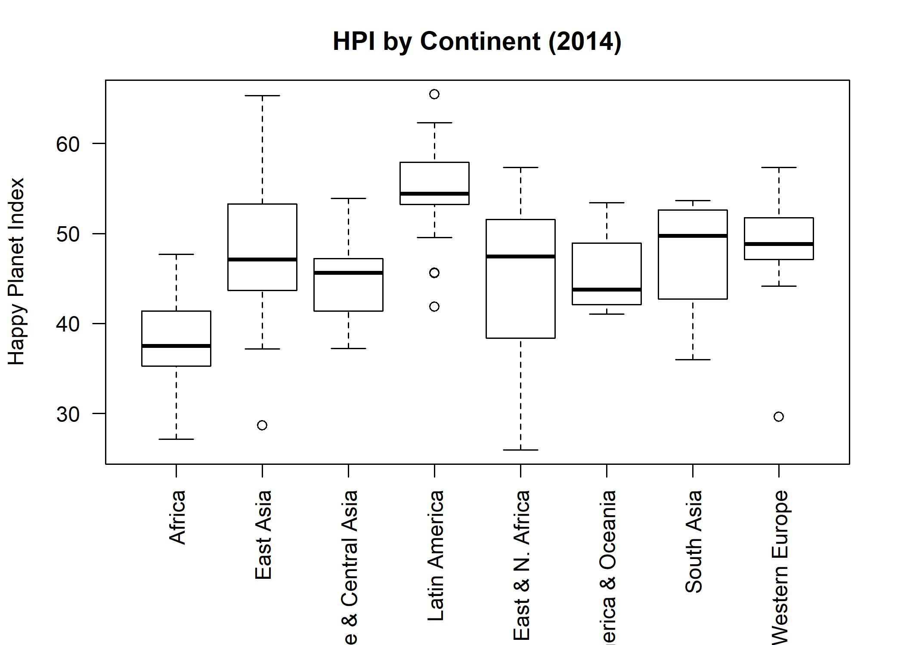
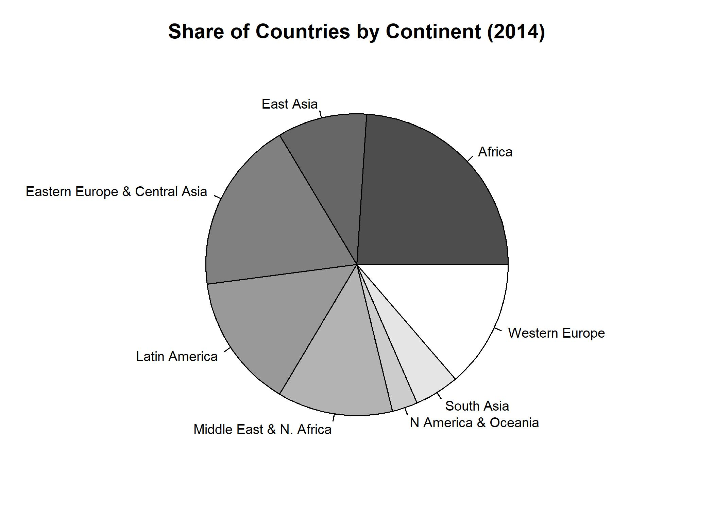
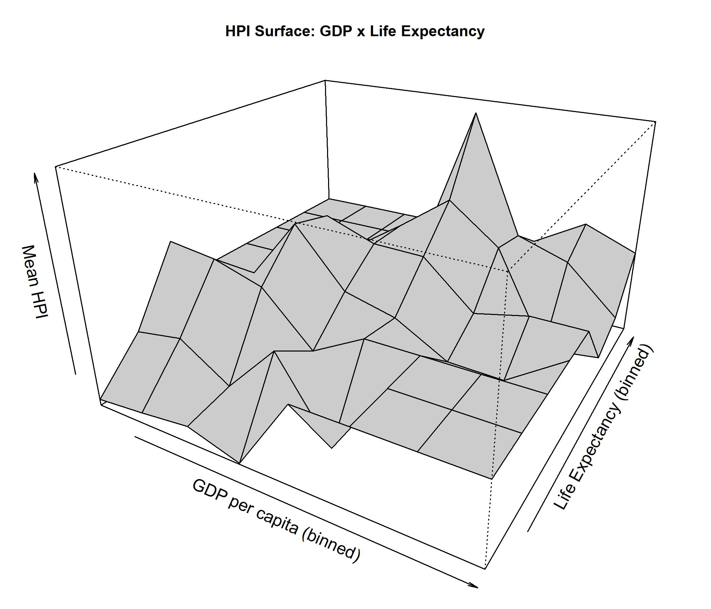
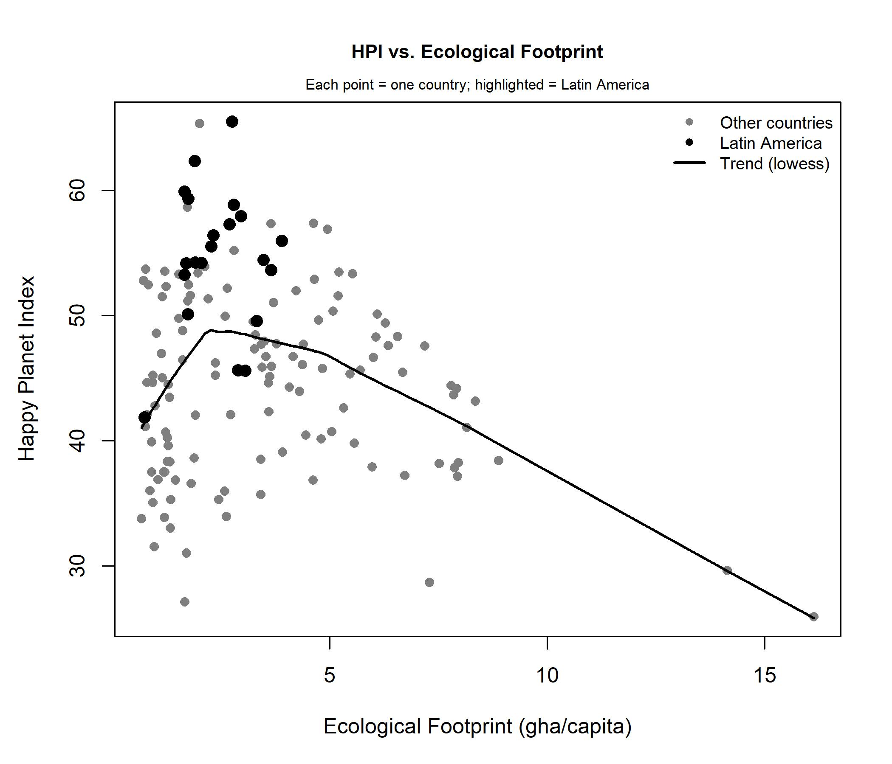
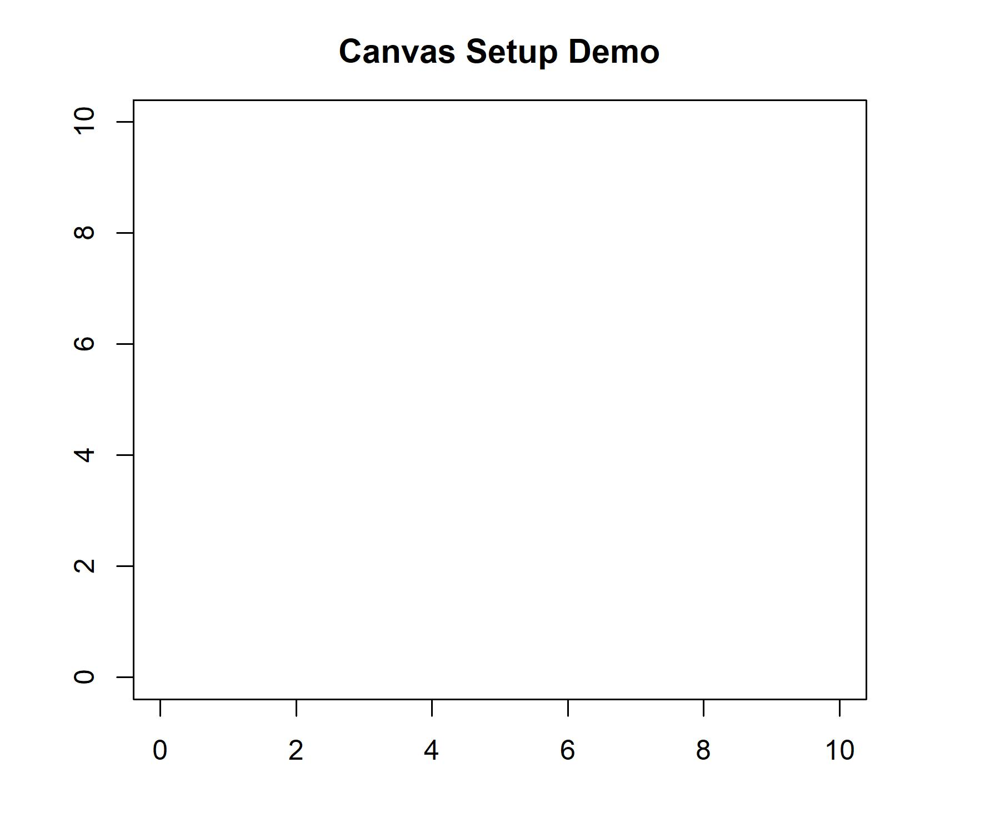

## Overview

This assignment works through Paul Murrell's Chapter 1 base R graphics code, then exercises each plotting function (`hist()`, `boxplot()`, `pie()`, `persp()`, `points()`, `lines()`, `text()`, `mtext()`, `legend()`, and the canvas-setup functions `par()`, `box()`, `axis()`) against the Happy Planet Index (HPI) dataset.

## Part 1: Murrell's Chapter 1 Code

Murrell's chapter 1 code (`murrell01.R`) was run line by line to observe how each call builds on the device incrementally, rather than all at once. Three questions posed in the code's comments:

**"Can you change `pch`?"** — Yes. `pch` controls the plotted point's character/shape. The default `pch=16` is a filled circle; `pch=17` gives a triangle, `pch=4` gives an X, `pch=1` gives an open circle.

**"Try different `cex` value?"** — `cex` is a character expansion factor controlling symbol size. `cex=2` doubles the default point size; smaller values (e.g. `cex=0.5`) shrink it.

**"What is the first number standing for?"** (in `axis(1, at=seq(0,16,4))`) — The first argument to `axis()` specifies which *side* of the plot the axis is drawn on: `1` = bottom, `2` = left, `3` = top, `4` = right.

## Part 2: Data Preparation

Data source: the Happy Planet Index public dataset (2006–2025), published by the Hot or Cool Institute, downloaded from [happyplanetindex.org](https://happyplanetindex.org/countries/).

**Year selection:** The dataset was filtered to **2014**, which has the strongest country coverage (146 of ~154 countries) of any year in the dataset. This avoids both the sparse early years (2006–2008) and the reduced data collection during the COVID-19 period (2020–2021).

```{r}
#| eval: false
library(readxl)
library(dplyr)

path <- "Happy-Planet-Index-2006-2025-public-data-set.xlsx"

hpi_raw <- read_excel(path, sheet = "All Data", skip = 1)
hpi_clean <- hpi_raw %>%
  filter(!is.na(HPI))

continent_lookup <- tibble(
  Continent = 1:8,
  Continent_name = c("Latin America", "N America & Oceania", "Western Europe",
                      "Middle East & N. Africa", "Africa", "South Asia",
                      "Eastern Europe & Central Asia", "East Asia")
)

hpi_clean %>%
  count(Year) %>%
  arrange(desc(n))

hpi_year <- hpi_clean %>%
  filter(Year == 2014)

nrow(hpi_year)  # 146

hpi_year_labeled <- hpi_year %>%
  left_join(continent_lookup, by = "Continent")
```

## Part 3: One Figure per Function

### Figure 1 — `hist()`: Distribution of HPI Scores

`hist()` controls the binning and display of a numeric variable's distribution. Here it shows how HPI scores are distributed across the 146 countries in the 2014 sample, with `freq=FALSE` converting the y-axis to density so the overlaid smoothed curve is on a comparable scale. The distribution is roughly bell-shaped with a slight right skew, peaking around 45–50.



```{r}
#| eval: false
par(mar=c(4.5, 4.1, 3.1, 2.1), cex.main=0.9)
hist(hpi_year$HPI, 
     breaks=10, 
     col="gray80", 
     freq=FALSE,
     main="Distribution of HPI Scores (2014)",
     xlab="Happy Planet Index")
lines(density(hpi_year$HPI, na.rm=TRUE), lwd=2)
```

### Figure 2 — `boxplot()`: HPI by Continent

`boxplot()` controls the display of a numeric variable's distribution (median, quartiles, outliers) split across groups. Here it compares the spread and median HPI score across the eight continents in 2014. Latin America shows the highest median, while Africa shows the lowest.



```{r}
#| eval: false
par(mar=c(7, 4.1, 3.1, 2.1))
boxplot(HPI ~ Continent_name, data = hpi_year_labeled,
        col = "white",
        las = 2,
        xlab = "",
        ylab = "Happy Planet Index",
        main = "HPI by Continent (2014)")
```

### Figure 3 — `pie()`: Share of Countries by Continent

`pie()` controls the display of a categorical variable's proportions as wedge sizes. Here it shows what share of the 146 sampled countries fall into each continent group.



```{r}
#| eval: false
par(mar=c(2, 4, 3, 4))
continent_counts <- table(hpi_year_labeled$Continent_name)
pie(continent_counts,
    col = gray(seq(0.3, 1.0, length.out = length(continent_counts))),
    main = "Share of Countries by Continent (2014)",
    cex = 0.8)
```

### Figure 4 — `persp()`: HPI Surface across GDP and Life Expectancy

`persp()` controls the 3D rendering of a surface defined over a grid. Since country-level data is tabular rather than naturally gridded, GDP per capita and life expectancy were each divided into 8 quantile bins, and mean HPI was computed within each cell to build a true x-y-z surface. The surface shows HPI peaking at moderate levels of both variables rather than rising monotonically with either, consistent with the HPI's design, which penalizes high ecological footprint.



```{r}
#| eval: false
gdp_breaks <- quantile(hpi_year$`GDP per capita`, probs = seq(0, 1, length.out = 9), na.rm = TRUE)
life_breaks <- quantile(hpi_year$`Life Expectancy`, probs = seq(0, 1, length.out = 9), na.rm = TRUE)

hpi_year$gdp_bin <- cut(hpi_year$`GDP per capita`, breaks = gdp_breaks, include.lowest = TRUE, labels = FALSE)
hpi_year$life_bin <- cut(hpi_year$`Life Expectancy`, breaks = life_breaks, include.lowest = TRUE, labels = FALSE)

z_matrix <- matrix(NA, nrow = 8, ncol = 8)
for (i in 1:8) {
  for (j in 1:8) {
    cell_vals <- hpi_year$HPI[hpi_year$gdp_bin == i & hpi_year$life_bin == j]
    if (length(cell_vals) > 0) z_matrix[i, j] <- mean(cell_vals, na.rm = TRUE)
  }
}
z_matrix[is.na(z_matrix)] <- mean(hpi_year$HPI, na.rm = TRUE)

par(mar=c(1, 1, 3, 1), cex.main=0.9)
persp(1:8, 1:8, z_matrix,
      theta = 30, phi = 25, expand = 0.6,
      col = "gray80",
      xlab = "GDP per capita (binned)",
      ylab = "Life Expectancy (binned)",
      zlab = "Mean HPI",
      main = "HPI Surface: GDP x Life Expectancy")
```

### Figure 5 — `points()` / `lines()` / `text()` / `mtext()` / `legend()`: HPI vs. Ecological Footprint

- **`lines()`** controls adding connected line segments to an existing plot; here it draws a `lowess()`-smoothed trend curve showing the overall relationship between footprint and HPI.
- **`points()`** controls adding symbol markers to an existing plot; here it re-plots Latin American countries in black on top of the base scatterplot to highlight them.
- **`text()`** controls placing a text label at specific data coordinates; here it labels the highlighted Latin America cluster directly on the plot.
- **`mtext()`** controls placing text in the plot's margin; here it adds an explanatory subtitle.
- **`legend()`** controls adding a key identifying plot elements; here it distinguishes the three visual elements (other countries, Latin America, trend line).

The trend line shows HPI peaking at moderate footprint levels and declining at high footprint, countries with very large ecological footprints do not achieve the highest HPI scores.



```{r}
#| eval: false
par(mar=c(5, 4.5, 4, 2), cex.main=0.9)
plot(hpi_year_labeled$`Ecological Footprint`, hpi_year_labeled$HPI,
     xlab = "Ecological Footprint (gha/capita)",
     ylab = "Happy Planet Index",
     main = "HPI vs. Ecological Footprint",
     pch = 16, col = "gray50")

ord <- order(hpi_year_labeled$`Ecological Footprint`)
lines(lowess(hpi_year_labeled$`Ecological Footprint`[ord], 
             hpi_year_labeled$HPI[ord]),
      col = "black", lwd = 2)

lat_am <- hpi_year_labeled$Continent_name == "Latin America"
points(hpi_year_labeled$`Ecological Footprint`[lat_am],
       hpi_year_labeled$HPI[lat_am],
       pch = 16, col = "black", cex = 1.3)

text(mean(hpi_year_labeled$`Ecological Footprint`[lat_am], na.rm=TRUE), 
     max(hpi_year_labeled$HPI[lat_am], na.rm=TRUE) + 3,
     "Latin America", cex = 0.8)

mtext("Each point = one country; highlighted = Latin America", side = 3, line = 0.3, cex = 0.7)

legend("topright", legend = c("Other countries", "Latin America", "Trend (lowess)"),
       col = c("gray50", "black", "black"),
       pch = c(16, 16, NA), lty = c(NA, NA, 1), lwd = c(NA, NA, 2),
       bty = "n", cex = 0.8)
```

### Figure 6 — `par()` / `box()` / `axis()`: Canvas Setup Demo

- **`par()`** controls global and per-plot graphical parameters (margins, layout, label orientation) that apply to whatever is drawn next.
- **`box()`** draws a border around the current plot region.
- **`axis()`** draws a labeled axis on a specified side of the plot at specified tick positions.



```{r}
#| eval: false
par(mar=c(4,4,3,4))
plot.new()
plot.window(xlim=c(0, 10), ylim=c(0, 10))
box()
axis(1, at=seq(0,10,2))
axis(2, at=seq(0,10,2))
title(main = "Canvas Setup Demo")
```

## AI Disclosure

AI assistance (Claude, Anthropic, Sonnet 4.6) was used in preparing this assignment: to debug R code (fixing a `setwd()`/path error, a missing-block rendering issue from the Murrell walkthrough), to adapt Murrell's example functions to the HPI dataset, and to help structure this write-up. See `prompts.md` for the full exchange log, tool/model/version, and a description of what was verified or corrected in the AI's output before use.
